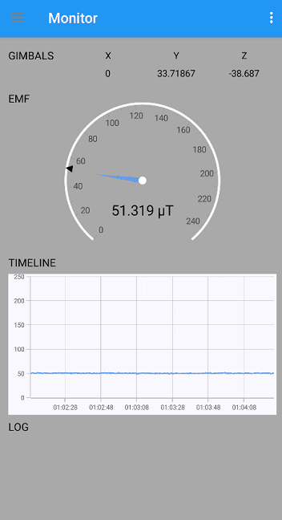

# Head Trip
EMF Meter 

This app logs time, emf, magnetometer raw sensor data, arbitrary magnitude, & geo-location.

# Purpose
 + Measure the earths magnetic fields 
 + Capture remote neural monitoring presense
 + Detect paranormal activity 

# Features 
 + Wake lock
 + Threshold for Sqlite3 Databse logging
 + Export Sqlite3 logging databases to disk
 + Threshold alarm with volume control
 + Graph simple PDF graphs from current or deported databases
 + Magnometer speed control
 + Accelerator speed control

# The Meter

# GRAPHING

# Download
Download the Android APK from the release page : [Android Release v1.0](https://github.com/michaelrinderle/Headtrip/releases/download/v1.0/net.sofdigital.headtrip-v1.0.apk)

iOS Support coming soon.
